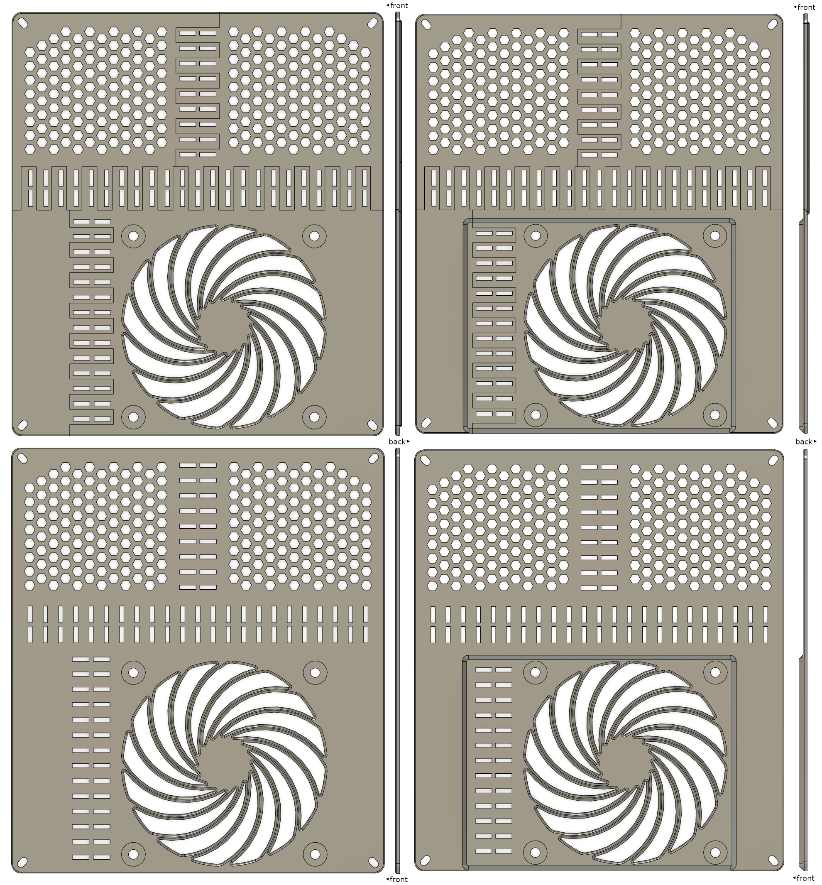
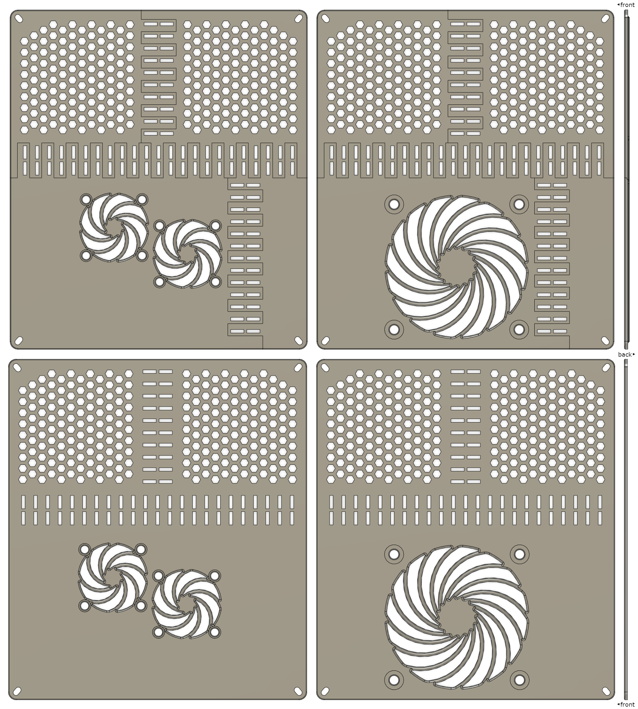

FlashForge Adventurer 3 bottom cover/lid
========================================

This design is a customised bottom cover/lid for the FlashForge Adventurer 3
3D-printer and its white-label variants like the Monoprice Voxel.

- Can be printed on the Adventurer 3.
- Low profile design - it doesn't make the bottom of the printer deeper.
- Support for 3 different fan configurations:
    - 1x 92mm Noctua NF-A9x14 fan
    - 1x 80mm fan
    - 2x 40mm fan (or 1x 40mm fan if you edit the mesh)

STL files
---------

Originally these files were available only on
[https://printables.com](https://printables.com)
where you can see a more organised view of the photos along with an
interactive 3D pre-render of the STL files (generated by printables.com).
I recommend using that site to explore the design.
This repo is a backup of the raw data.

- External files on printables.com:
    - [Noctua NF-A9x14 (92x14mm) fan](https://www.printables.com/model/456606-flashforge-adventurer-3-bottom-coverlid-for-noctua)
    - [80mm fan or 40mm fans](https://www.printables.com/model/270288-flashforge-adventurer-3-bottom-coverlid-for-80mm-f)
- Local files:
    - [README: Noctua NF-A9x14 (92x14mm) fan](./nf-a9x14.md)
    - [README: 80mm fan or 40mm fans](./40mm_or_80mm.md)
    - [STL files](./stl)

License
-------

[Creative Commons Attribution 4.0 International](./LICENSE.txt)

Quick Preview
-------------

